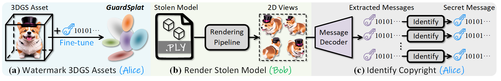
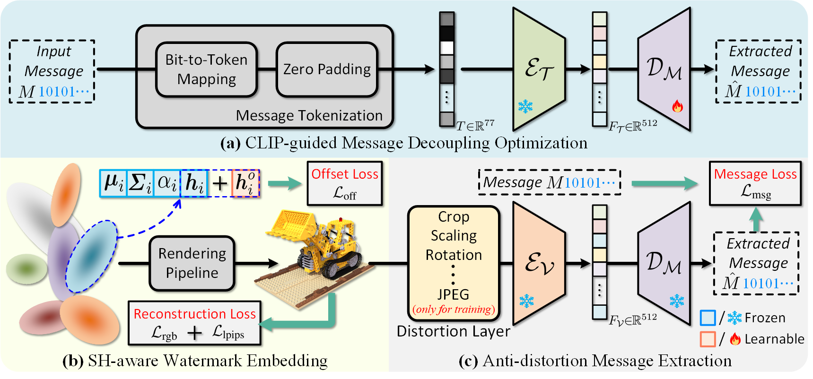

# GuardSplat: Efficient and Robust Watermarking for 3D Gaussian Splatting

[Zixuan Chen](https://narcissusex.github.io), [Guangcong Wang](https://wanggcong.github.io/), [Jiahao Zhu](), [Jian-Huang Lai](https://cse.sysu.edu.cn/content/2498), [Xiaohua Xie](https://cse.sysu.edu.cn/content/2478). 

**IEEE/CVF Conference on Computer Vision and Pattern Recognition (CVPR)**, 2025

**TL;DR:** GuardSplat is an efficient watermarking framework to protect the copyright of 3DGS assets. It presents superior performance to state-of-the-art watermarking approaches in capacity, invisibility, robustness, security, and training efficiency.

---

<!-- [[Paper]](https://arxiv.org/abs/2411.19895) [[Project Page]](https://narcissusex.github.io/GuardSplat/) [[Demo Video]](https://youtu.be/QgejiJE2-5g) [[Materials & Pretrained Models]](https://drive.google.com/drive/folders/1U3OR5z5EOC7S5bicS2aYi199GX2Lv5e3?usp=drive_link) -->

<span class="links">
  <a  href="https://arxiv.org/abs/2411.19895" rel="nofollow"></a>
  <a  href="https://arxiv.org/abs/2411.19895" rel="nofollow"></a>
  <a href="https://narcissusex.github.io/GuardSplat" rel="nofollow"></a>
  <a href="https://youtu.be/QgejiJE2-5g" rel="nofollow"></a>
</span>


<div align=center>

</div>
<b>Application scenarios of GuardSplat.</b> To protect the copyright of 3D Gaussian Splatting (3DGS) assets, <b>(a)</b> the owners (<font style="color:#058CFA;">Alice</font>) can use our <b>GuardSplat</b> to embed the secret message (<font style="color: blue;">blue key</font>) into these models. <b>(b)</b> If malicious users (<font style="color:#00B050">Bob</font>) render views for unauthorized uses, <b>(c)</b> <font style="color:#058CFA;">Alice</font> can use the private message decoder to extract messages (<font style="color:plum">purple key</font>) for copyright identification.

<!-- ## Abstract

3D Gaussian Splatting (3DGS) has recently created impressive assets for various applications. However, the copyright of these assets is not well protected as existing watermarking methods are not suited for 3DGS considering security, capacity, and invisibility. Besides, these methods often require hours or even days for optimization, limiting the application scenarios. In this paper, we propose **GuardSplat**, an innovative and efficient framework that effectively protects the copyright of 3DGS assets.
Specifically, **1)** We first propose a CLIP-guided Message Decoupling Optimization module for training the message decoder, leveraging CLIP's aligning capability and rich representations to achieve a high extraction accuracy with minimal optimization costs, presenting exceptional **capability** and **efficiency**.
**2)** Then, we propose a Spherical-harmonic-aware (SH-aware) Message Embedding module tailored for 3DGS, which employs a set of SH offsets to seamlessly embed the message into the SH features of each 3D Gaussian while maintaining the original 3D structure.
It enables the 3DGS assets to be watermarked with minimal fidelity trade-offs and prevents malicious users from removing the messages from the model files, meeting the demands for **invisibility** and **security**.
**3)** We further propose an Anti-distortion Message Extraction module to improve **robustness** against various visual distortions.
Extensive experiments demonstrate that **GuardSplat** outperforms the state-of-the-art methods and achieves fast optimization speed. -->

## Framework

<div align=center>

</div>

**Overview of GuardSplat.** **(a)** Given a binary message $M$, we first transform it into CLIP tokens $T$ using the proposed message tokenization.
We then employ CLIP's textual encoder $\mathcal{E _T}$ to map $T$ to the textual feature $F _\mathcal{T}$.
Finally, we feed $F _\mathcal{T}$ into message decoder $\mathcal{D _M}$ to extract the message $\hat{M}$ for optimization.
**(b)** For each 3D Gaussian, we freeze all the attributes and build a learnable spherical harmonic (SH) offset $\boldsymbol{h}^o _i$ as the watermarked SH feature, which can be added to the original SH features as $\boldsymbol{h} _i + \boldsymbol{h}^o _i$ to render the watermarked views.
**(c)** We first feed the 2D rendered views to CLIP's visual encoder $\mathcal{E _V}$ to acquire the visual feature $F _{\mathcal{V}}$ and then employ the pre-trained message decoder to extract the message $\hat{M}$.
A differentiable distortion layer is used to simulate various visual distortions during optimization.
$\mathcal{D _M}$ and $\boldsymbol{h}^o _i$ are optimized by the corresponding losses, respectively.

## 1) Get start

* Python 3.12
* CUDA 12.1 or *higher*
* NVIDIA RTX 3090
* PyTorch 2.5.1 or *higher*

**Create a python env using conda**
```bash
conda create -n GuardSplat python=3.12 -y
conda activate GuardSplat
```

**Install the required libraries**
```bash
bash setup.sh
```

Please see *setup.sh* in details.

## 2) Train and evaluate the message decoder
```bash
python make_decoder.py --mode train --msg_len <message_length> --save --num_epochs <training_epochs>
python make_decoder.py --mode test --msg_len <message_length>
```

## 3) Train a 3DGS model
```bash
python gaussian-splatting/train.py -s <nerf_dir>/<nerf_item> -m <result_dir> -w 
```

## 4) Watermark a 3DGS model (blender or llff mode)
```bash
# no distortions
python run_watermark.py -s <nerf_dir>/<nerf_item> -m <result_dir> -w --mode train --msg_len <message_length> --sdir <watermark_dir> --dtype blender

# single distortion
python run_watermark.py -s <nerf_dir>/<nerf_item> -m <result_dir> -w --mode train --msg_len <message_length> --sdir <watermark_dir> --dtype blender atypes <distortion>

# combined distortions
python run_watermark.py -s <nerf_dir>/<nerf_item> -m <result_dir> -w --mode train --msg_len <message_length> --sdir <watermark_dir> --dtype blender atypes <distortion1> <distortion2> ... <distortionN>
```

More details can be shown in *run.sh*.

## Citation

```tex
@InProceedings{chen2025guardsplat,
    author={Chen, Zixuan and Wang, Guangcong and Zhu, Jiahao and Lai, Jian-Huang and Xie, Xiaohua},
    title={GuardSplat: Efficient and Robust Watermarking for 3D Gaussian Splatting},
    year={2025},
    booktitle={Proceedings of the IEEE/CVF International Conference on Computer Vision and Pattern Recognition (CVPR)},
}
```

## Acknowledgement 

We build our project based on **[gaussian-splatting](https://github.com/graphdeco-inria/gaussian-splatting)** and **[CLIP](https://github.com/openai/CLIP)**.
The differentiable JPEG compression and VAE attack are implemented based on **[Diff-JPEG](https://github.com/necla-ml/Diff-JPEG)** and **[WatermarkAttacker](https://github.com/XuandongZhao/WatermarkAttacker)**, respectively.
We also follow the settings used in **[CopyRNeRF](https://github.com/luo-ziyuan/CopyRNeRF-code/)** and **[WateRF](https://github.com/kuai-lab/cvpr2024_WateRF)**.
We sincerely thank them for their wonderful work and code release.